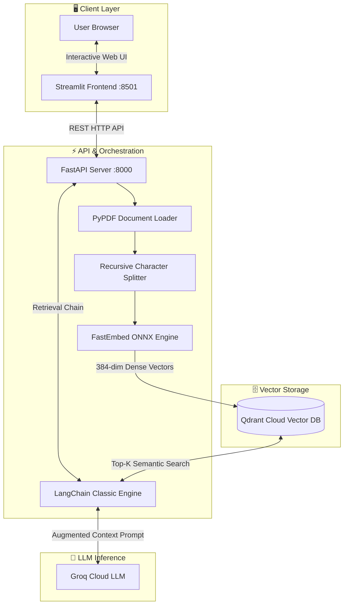

<div align="center">

# ⚡ Intelligent Document Assistant (Enterprise RAG Chatbot)

<p align="center">
  <strong>A high-performance, production-ready Retrieval-Augmented Generation (RAG) system built with FastAPI, LangChain, Qdrant Cloud, FastEmbed, and Groq LLM.</strong>
</p>

[](https://www.python.org/)
[](https://fastapi.tiangolo.com/)
[](https://streamlit.io/)
[](https://www.langchain.com/)
[](https://qdrant.tech/)
[](https://groq.com/)
[](LICENSE)

<br/>

[✨ Features](#-key-features) • [🏛 Architecture](#-architecture-overview) • [🛠 Tech Stack](#-tech-stack) • [🚀 Quick Start](#-quick-start) • [📡 API Reference](#-api-endpoints) • [⚙ Configuration](#-environment-variables)

<br/>

---

</div>

## 📖 Overview

The **Enterprise RAG Chatbot** enables users to upload PDF documents, extract embeddings into a cloud vector store (**Qdrant**), and query complex technical or enterprise documentation with sub-second response latencies.

Powered by **Groq LPU™ Inference Engine** (`gpt-oss-120b` / `llama-3.1-8b-instant`) and ONNX-accelerated **FastEmbed** embeddings, the architecture is engineered to deliver enterprise accuracy while consuming **<100MB RAM**, fitting seamlessly inside free-tier deployments (e.g. Render, Railway, HuggingFace Spaces) without memory limits or crashes.

---

## ✨ Key Features

- ⚡ **Ultra-Low Latency Inference**: Uses Groq's high-speed LPU cloud for lightning-fast token generation.
- 🎯 **Lightweight FastEmbed Embeddings**: Uses `BAAI/bge-small-en-v1.5` over ONNX Runtime for CPU efficiency and minimal memory footprint.
- ☁ **Cloud-Native Vector Search**: Integrates directly with **Qdrant Cloud** vector database for scalable cosine similarity search.
- 🎨 **Modern Streamlit Web App**:
  - Sleek dark theme with responsive glassmorphic UI.
  - PDF upload, live progress tracking, and chunk indexing status.
  - Interactive quick starter questions.
  - Per-message timestamps and response latency telemetry.
  - One-click conversation export (`.md`).
  - Database purge & reset functionality.
- 🛡 **Robust API Backend**: Decoupled, production-ready **FastAPI** service with strict schema validation via Pydantic and CORS middleware.
- 📦 **DevContainer Ready**: Pre-configured VS Code Dev Container for effortless one-click setup.

---

## 🏛 Architecture Overview



---

## 🛠 Tech Stack

| Component | Technology | Purpose |
| :--- | :--- | :--- |
| **API Framework** | [FastAPI](https://fastapi.tiangolo.com/) | High-speed asynchronous REST API server |
| **Frontend UI** | [Streamlit](https://streamlit.io/) | Interactive chat interface with custom CSS |
| **RAG Orchestration** | [LangChain](https://www.langchain.com/) | Retrieval QA chains & prompt templates |
| **Vector Database** | [Qdrant Cloud](https://qdrant.tech/) | High-performance vector index & search |
| **Embeddings** | [FastEmbed](https://github.com/qdrant/fastembed) | BAAI/bge-small-en-v1.5 (ONNX Runtime, 384-dim) |
| **LLM Inference** | [Groq](https://groq.com/) | High-speed LLM inference engine |
| **PDF Extraction** | [PyPDF](https://pypdf.readthedocs.io/) | Fast PDF document parsing |

---

## 📁 Repository Structure

```text
rag-chatbot/
├── .devcontainer/             # VS Code Dev Container configuration
│   └── devcontainer.json
├── backend/
│   └── main.py                # FastAPI RAG API, LangChain chains & Qdrant logic
├── frontend/
│   └── app.py                 # Streamlit web application & modern chat interface
├── .gitignore                 # Git ignore rules
├── README.md                  # Project documentation
└── requirements.txt           # Python dependencies
```

---

## 🚀 Quick Start

### 1. Prerequisites

- **Python 3.10+**
- A free **[Groq Cloud API Key](https://console.groq.com/)**
- A free **[Qdrant Cloud Cluster](https://cloud.qdrant.io/)** (URL & API Key)

### 2. Clone the Repository

```bash
git clone https://github.com/eswarreddy29/rag-chatbot-fastapi-streamlit.git
cd rag-chatbot-fastapi-streamlit
```

### 3. Create Virtual Environment & Install Dependencies

```bash
# Create virtual environment
python -m venv venv

# Activate virtual environment
# On Windows:
venv\Scripts\activate
# On macOS/Linux:
source venv/bin/activate

# Install requirements
pip install --upgrade pip
pip install -r requirements.txt
```

### 4. Configure Environment Variables

Create a `.env` file in the project root:

Edit `.env`:
```env
GROQ_API_KEY=gsk_your_groq_api_key_here
QDRANT_URL=https://your-cluster-id.us-east-1-0.aws.cloud.qdrant.io:6333
QDRANT_API_KEY=your_qdrant_api_key_here
BACKEND_URL=http://localhost:8000
TEMP_DOCS_DIR=/tmp/documents
```

---

## 🏃 Running the Application

### Step 1: Start the FastAPI Backend

Open a terminal and run:

```bash
uvicorn backend.main:app --host 0.0.0.0 --port 8000 --reload
```
> The API will be accessible at `http://localhost:8000`. Swagger API documentation is available at `http://localhost:8000/docs`.

### Step 2: Start the Streamlit Frontend

Open a second terminal (with the virtual environment activated) and run:

```bash
streamlit run frontend/app.py
```
> The web application will launch at `http://localhost:8501`.

---

## 📡 API Endpoints

The FastAPI backend exposes the following REST endpoints:

### `POST /upload`
Uploads and indexes a PDF document into Qdrant.
- **Request**: Multipart Form (`file: PDF`)
- **Response**:
```json
{
  "message": "Successfully processed and indexed enterprise_guide.pdf"
}
```

### `POST /query`
Performs semantic similarity retrieval and queries the LLM with augmented context.
- **Request Body**:
```json
{
  "question": "What are the main security guidelines discussed in section 2?"
}
```
- **Response**:
```json
{
  "answer": "Based on the uploaded document, section 2 outlines..."
}
```

### `POST /clear`
Flushes the collection in Qdrant and cleans up temporary local files.
- **Response**:
```json
{
  "message": "Knowledge base and chat history cleared successfully!"
}
```

---

## ⚙ Environment Variables

| Variable | Required | Default | Description |
| :--- | :---: | :---: | :--- |
| `GROQ_API_KEY` | **Yes** | — | API key from Groq Console |
| `QDRANT_URL` | **Yes** | — | Cluster URL from Qdrant Cloud |
| `QDRANT_API_KEY` | **Yes** | — | API Key from Qdrant Cloud |
| `BACKEND_URL` | No | `http://localhost:8000` | Backend API URL accessed by Streamlit |
| `TEMP_DOCS_DIR` | No | `/tmp/documents` | Temporary local directory for uploaded files |

---

## 💡 How It Works

1. **Document Ingestion**: The user uploads a PDF via the Streamlit sidebar.
2. **Chunking**: LangChain splits the text using `RecursiveCharacterTextSplitter` (chunk size: 1000 characters, overlap: 200).
3. **Embedding Generation**: `FastEmbed` generates 384-dimensional dense vectors using the ONNX-optimized `BAAI/bge-small-en-v1.5` model.
4. **Vector Indexing**: Vectors and payload metadata are stored in the Qdrant Cloud collection.
5. **Contextual Retrieval**: When a question is received, Qdrant searches for top-$k$ matching chunks via cosine similarity.
6. **Augmented Synthesis**: The retrieved chunks are structured into a system prompt passed to Groq LLM, delivering an accurate, grounded, and engaging response.

---

## 🤝 Contributing

Contributions, issues, and feature requests are welcome!

1. Fork the Project
2. Create your Feature Branch (`git checkout -b feature/AmazingFeature`)
3. Commit your Changes (`git commit -m 'Add some AmazingFeature'`)
4. Push to the Branch (`git push origin feature/AmazingFeature`)
5. Open a Pull Request

---

## 📄 License

Distributed under the **MIT License**. See `LICENSE` for more information.

<div align="center">
  <sub>Built with ❤️ by <a href="https://github.com/eswarreddy29">eswarreddy29</a></sub>
</div>
